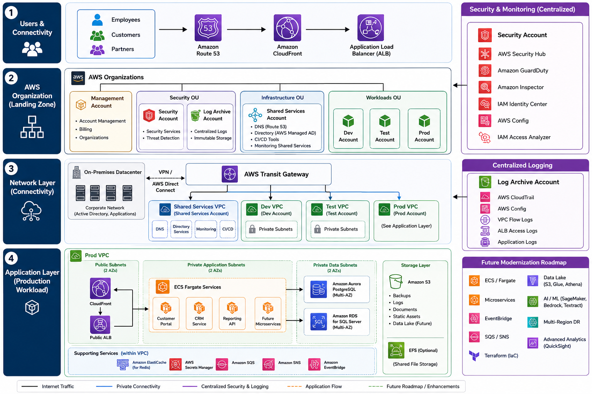

# Project 4: Enterprise Migration & Landing Zone Strategy

## Overview

This project presents a cloud migration strategy for a mid-sized industrial manufacturing company migrating from two on-premises datacenters to AWS over an 18-month programme. The engagement covers application portfolio assessment, AWS 7Rs migration strategy, multi-account landing zone design, target architecture, phased migration waves, security and governance controls, and a long-term modernisation roadmap.

Unlike the previous three projects in this portfolio which demonstrate hands-on technical implementation, this project demonstrates Solutions Architect thinking at the enterprise level — the kind of work that happens before a single workload moves to the cloud. It reflects the planning, stakeholder alignment, risk management, and architectural decision-making that characterises real AWS migration engagements.

The project is structured around AWS Migration Acceleration Program (MAP) best practices and the AWS Well-Architected Framework, with the goal of achieving complete datacenter exit within 18 months while establishing a secure, scalable cloud foundation for future modernisation.

## Customer Profile

**Company:** Alpine Manufacturing GmbH
**Industry:** Industrial Manufacturing
**Headquarters:** Munich, Germany
**Additional locations:** Prague, Warsaw
**Size:** 500 employees

**Current environment:**

| Resource | Quantity |
|---|---|
| VMware virtual machines | 150 |
| Windows servers | 90 |
| Linux servers | 60 |
| SQL Server instances | 8 |
| Oracle databases | 2 |
| File servers | 6 |
| Business applications | 50 |
| Active Directory forests | 1 |

The company runs two on-premises datacenters supporting manufacturing, logistics, finance, and customer operations. Infrastructure is VMware-based with a mix of Windows and Linux workloads, Microsoft SQL Server, Oracle databases, and Windows file servers. Microsoft Active Directory provides identity services across all locations.

## Business Drivers & Challenges

The immediate business driver is a hard deadline: both datacenter contracts expire in 18 months. Leadership cannot renew them and has committed to a full cloud migration within that window.

Beyond the contract deadline, the organisation faces a set of operational challenges that have been accumulating for several years. Hardware is aging and approaching end-of-life, creating both reliability risk and the prospect of a significant capital refresh investment if the company were to stay on-premises. VMware licensing costs have increased substantially and represent a major component of the infrastructure budget with limited return. Server provisioning cycles are long — new environments take weeks to provision rather than minutes — which directly impacts development velocity and time to market.

Disaster recovery capability is limited. The current arrangement provides an estimated 24-hour recovery time objective, which is insufficient for the customer-facing applications that drive revenue. The business requires a four-hour RTO target to meet customer SLAs and protect manufacturing continuity.

Monitoring is fragmented across multiple tools with no centralised visibility, making incident detection slow and root cause analysis difficult. Deployments are largely manual, introducing human error risk and limiting release frequency.

## Migration Objectives

The migration programme has five measurable objectives that guide every architectural decision.

**Objective 1 — Datacenter exit:** complete migration of all eligible workloads from both datacenters within 18 months.

**Objective 2 — Cost reduction:** reduce infrastructure operating costs by 20% over three years through datacenter exit, hardware refresh avoidance, VMware licence elimination, and cloud-native cost optimisation.

**Objective 3 — Improved disaster recovery:** reduce Recovery Time Objective from 24 hours to under 4 hours and Recovery Point Objective to under 15 minutes through AWS Multi-AZ architecture and automated backup strategies.

**Objective 4 — Secure landing zone:** establish a multi-account AWS environment with centralised security, logging, and governance controls that can scale as the organisation grows.

**Objective 5 — Modernisation foundation:** migrate business-critical customer-facing applications to cloud-native services (ECS Fargate, Aurora PostgreSQL, CloudFront) to improve scalability and reduce operational overhead.

## Application Portfolio Assessment

Before designing the AWS architecture, a full application inventory and criticality assessment is required. This determines migration sequencing, target architecture choices, and risk mitigation strategies.

**Tier 1 — Mission Critical**

These applications directly impact revenue, customers, or production operations. Downtime tolerance is under 4 hours.

| Application | Function | Primary users |
|---|---|---|
| ERP System | Manufacturing and finance operations | 300 |
| CRM Platform | Sales and customer management | 150 |
| Manufacturing Execution System (MES) | Production line control | 200 |
| Customer Portal | External customer orders | External |
| SQL Reporting Platform | Business intelligence and reporting | 100 |

**Tier 2 — Important Business Systems**

These applications cause significant disruption when unavailable but do not immediately stop revenue or production. Downtime tolerance is under 24 hours.

HR System, Procurement Portal, Inventory Management, Document Management, Analytics Platform, Internal Wiki.

**Tier 3 — Supporting Systems**

Low criticality. Downtime tolerance is several days. Development environments, test environments, internal utility servers, legacy file shares, monitoring servers, print services.

**Dependency Assessment**

Application dependencies are one of the most common causes of migration delays in enterprise programmes. The most important dependency chain in this environment runs through the customer-facing stack:

```
Customer Portal
    ↓
CRM Platform
    ↓
ERP System
    ↓
SQL / Oracle Databases
```

This means the Customer Portal cannot migrate before the CRM integration is addressed, and the CRM cannot migrate before the ERP database layer is stable on AWS. This dependency chain directly informs the migration wave sequencing in Section 8.

**Key Findings**

Approximately 40% of workloads are VMware-based lift-and-shift candidates requiring minimal application changes. Several applications have tight SQL and Oracle database dependencies that require careful sequencing. Customer-facing applications require high availability architecture from day one on AWS, not as a future improvement. Development and test systems can migrate first with minimal business risk, making them ideal for validating tooling and processes.

## AWS 7Rs Migration Strategy

The 7Rs framework assigns the most appropriate migration strategy to each workload based on business criticality, technical complexity, migration risk, and long-term modernisation intent.

| Application | Strategy | Rationale | Target |
|---|---|---|---|
| ERP System | Replatform | Business critical with complex dependencies; not ready for full refactor but can benefit from managed database services | EC2 + Aurora PostgreSQL |
| CRM Platform | Rehost | Low migration risk; fast migration; minimal application changes required | EC2 + RDS SQL Server |
| Customer Portal | Refactor | Customer-facing; scalability requirements; long-term modernisation target | ECS Fargate + ALB + Aurora + CloudFront |
| Manufacturing Execution System | Retain | Factory equipment integration; specialised hardware dependencies; cannot migrate initially | On-premises |
| HR System | Rehost | Standard Windows workload; straightforward migration | EC2 + RDS |
| Internal Wiki | Repurchase | Replace self-hosted solution with SaaS equivalent; eliminates maintenance overhead | Confluence Cloud |
| Legacy File Servers | Retire | Content audited and found no longer required; eliminates migration scope | Decommission |
| Dev Environments | Relocate | Can move quickly using VMware Cloud on AWS; minimal disruption to development teams | VMware Cloud on AWS |

**Migration strategy distribution across all 50 applications:**

| Strategy | Application count |
|---|---|
| Rehost | 20 |
| Replatform | 10 |
| Refactor | 5 |
| Repurchase | 3 |
| Retire | 7 |
| Retain | 3 |
| Relocate | 2 |

This distribution is realistic for an enterprise migration of this scale. The majority of workloads (Rehost + Replatform = 60%) move with minimal or moderate changes, reducing programme risk and timeline. Only a small subset justifies the cost and time of full Refactor. Retiring 7 applications reduces total migration scope and eliminates ongoing operational cost for systems that provide no business value.

## Landing Zone Design

The AWS landing zone is the foundation that everything else is built on. Before any workload migrates, the landing zone must be in place — account structure, networking, identity, security controls, and governance. Getting this wrong at the start creates technical debt that is expensive to fix later.

**AWS Organizations structure**

The design uses a multi-account model with Organisational Units grouping accounts by function. This provides security isolation between environments, independent billing visibility, separate permission boundaries, and a clear ownership model.

```
AWS Organization
│
├── Management Account
│   Account management, billing, SCP administration
│   No workloads
│
├── Security OU
│   ├── Security Account
│   │   GuardDuty, Security Hub, Inspector, IAM Access Analyzer
│   │   All security findings aggregate here
│   └── Log Archive Account
│       CloudTrail, AWS Config, VPC Flow Logs, ALB logs
│       Immutable storage — security teams investigate without touching workload accounts
│
├── Infrastructure OU
│   └── Shared Services Account
│       DNS (Route 53), Active Directory (AWS Managed AD)
│       CI/CD tooling, monitoring, bastion replacement (SSM)
│
└── Workloads OU
    ├── Dev Account     — developer experimentation, lower controls, non-production data
    ├── Test Account    — UAT, performance testing, release validation
    └── Prod Account    — business workloads, highest controls
```

**Identity strategy**

IAM Identity Center replaces individual IAM users across all accounts. Centralised authentication with Single Sign-On, role-based access control, and MFA enforcement for all privileged access. Example permission sets: Cloud Administrator, Security Engineer, Developer (Dev/Test only), Operations Engineer, Finance (billing read-only), Auditor (read-only).

**Network design**

AWS Transit Gateway connects on-premises datacenters (via VPN initially, Direct Connect in later phases) to all VPCs in a hub-and-spoke topology. This is the correct choice over VPC peering for an environment with multiple VPCs and future growth expectations — Transit Gateway provides centralised routing, simpler management, and eliminates the N-squared peering complexity.

Each account has its own VPC with three subnet tiers: public subnets for internet-facing load balancers, private application subnets for compute, and private data subnets for databases. No database is ever directly reachable from the internet.

**Governance controls**

Service Control Policies (SCPs) are applied at the OU level to enforce non-negotiable guardrails: CloudTrail cannot be disabled, Config rules cannot be deleted, GuardDuty cannot be disabled, and resources cannot be created outside approved AWS regions. These controls cannot be overridden by account administrators, providing a consistent security baseline regardless of what individual teams do within their accounts.

Mandatory resource tagging enforces: Application, Environment, Owner, CostCenter, BusinessUnit. Tags drive cost allocation, automation, and ownership accountability.

## Target Architecture

**Architecture diagram:**

 

The target production architecture runs in the Prod Account VPC across four layers.

**Layer 1 — Connectivity**
Users (employees, customers, partners) reach the platform via Route 53 for DNS resolution, CloudFront for global content delivery and edge security, and an internet-facing Application Load Balancer for HTTPS termination and path-based routing.

**Layer 2 — Compute (private application subnets, 2 AZs)**
ECS Fargate services run the customer-facing applications — Customer Portal, CRM web services, and Reporting API — in private subnets with no public IP assignment. The ERP system runs on EC2 instances with a managed migration path to containers in a later modernisation phase.

**Layer 3 — Data (private data subnets, 2 AZs)**
Amazon Aurora PostgreSQL Multi-AZ serves as the primary database for migrated Oracle workloads. Amazon RDS for SQL Server Multi-AZ handles the CRM and reporting databases that remain on SQL Server. Both are deployed in private data subnets accessible only from the application tier security groups.

**Layer 4 — Storage**
Amazon S3 replaces Windows file servers for backups, logs, documents, and static assets. Amazon EFS provides shared file storage for applications requiring POSIX file system access. S3 lifecycle policies automatically tier older objects to lower-cost storage classes.

**Supporting services within the VPC:**
ElastiCache (Redis) for session management and caching, Secrets Manager for all credentials and API keys, SQS and SNS for asynchronous workflows, EventBridge for event-driven integration between services.

**Disaster recovery:**
Aurora Multi-AZ provides automatic failover with under 30 seconds RTO for database failures. AWS Backup runs automated daily snapshots with cross-region copies retained for 35 days. Pilot Light DR configuration in a secondary region enables full recovery within the 4-hour RTO target for a complete regional failure.

## Migration Waves & Roadmap

The migration is sequenced into six waves over 18 months. Each wave starts with the lowest-risk workloads to validate tooling and build operational confidence before moving business-critical systems.

**Wave 0 — Foundation (Months 1-2)**
Build the AWS landing zone before any workload migrates. AWS Organizations structure, account provisioning, IAM Identity Center, Transit Gateway, VPN connectivity to on-premises, CloudTrail, GuardDuty, AWS Config, centralised logging. Success criteria: AWS platform is operational and security baseline is active.

**Wave 1 — Development and test systems (Months 2-4)**
Strategy: Rehost. Migrate development VMs, test environments, and internal utility servers. These have no production traffic and minimal business risk. The primary goal is validating migration tooling (AWS Application Migration Service), runbooks, and operational processes before touching production systems. Success criteria: migration runbooks validated, team AWS operational confidence established.

**Wave 2 — Internal business applications (Months 4-7)**
Strategy: Rehost, Repurchase, Replatform. Migrate HR System, Document Management, Internal Wiki (repurchase to Confluence Cloud), and Reporting Platform. Expands AWS footprint while systems are non-customer-facing. Operational teams gain experience managing production workloads on AWS in a lower-risk context.

**Wave 3 — Customer-facing services (Months 7-11)**
Strategy: Replatform, Refactor. Migrate Customer Portal, Partner Portal, and CRM Frontend. These are the most visible applications to customers and require the full target architecture — CloudFront, ALB, ECS Fargate, Aurora. This wave is sequenced after Wave 2 deliberately — by this point the team has AWS operational experience and the networking and security controls are proven.

**Wave 4 — Databases (Months 10-14)**
Strategy: Replatform using AWS DMS and Schema Conversion Tool. Migrate Oracle workloads to Aurora PostgreSQL and SQL Server databases to RDS SQL Server. Database migrations are the highest technical risk activity in the programme — schema conversion, data validation, cutover planning, and rollback procedures are all more complex than compute migrations. Overlapping with Wave 3 completion is intentional to allow database stabilisation before the ERP migration begins.

**Wave 5 — ERP modernisation (Months 14-18)**
Strategy: Replatform. Migrate the ERP system last — it has the highest business impact, the largest dependency chain, and the most complex database requirements. By Month 14 the team has migrated 45+ applications successfully. Every process, tool, and runbook is validated. The ERP migration is the most risk-managed migration of the programme, not the least. Success criteria: datacenter exit complete.

**Workloads remaining on-premises:**
The Manufacturing Execution System and factory equipment integrations are retained on-premises beyond the 18-month window. These have specialised hardware dependencies and factory network connectivity requirements that make cloud migration infeasible in the initial programme. They are reviewed in Year 2 of the modernisation roadmap.

**Migration timeline:**

| Wave | Scope | Months |
|---|---|---|
| Wave 0 | Landing zone foundation | 1-2 |
| Wave 1 | Dev and test systems | 2-4 |
| Wave 2 | Internal business applications | 4-7 |
| Wave 3 | Customer-facing services | 7-11 |
| Wave 4 | Databases | 10-14 |
| Wave 5 | ERP modernisation | 14-18 |

## Security & Governance

Security is designed into the landing zone from day one rather than added after migration. The multi-account model is the primary security control — blast radius of any incident is contained to a single account and cannot spread to the security or log archive accounts.

**Identity and access**
IAM Identity Center enforces centralised authentication with MFA required for all privileged access and all console logins. No long-lived IAM access keys. All human access uses role-based permission sets with the minimum permissions required. Service-to-service access uses IAM roles attached to compute resources — no credentials stored in code or configuration files.

**Network security**
Only CloudFront and the Application Load Balancer receive internet traffic. All compute (ECS tasks, EC2 instances) runs in private subnets with no public IP assignment. All databases run in separate private data subnets accessible only from application tier security groups. Security groups follow least-privilege — each tier only accepts traffic from the tier immediately above it.

**Data protection**
All data at rest encrypted using AWS KMS: Aurora, RDS, EBS, S3, EFS. All data in transit uses TLS 1.2 or higher. All application credentials, database passwords, and API keys stored in AWS Secrets Manager — never in Terraform code, application code, or configuration files.

**Threat detection and monitoring**
GuardDuty provides continuous threat detection across all accounts, analysing CloudTrail, VPC Flow Logs, and DNS logs for suspicious activity. Security Hub aggregates findings from GuardDuty, Inspector, IAM Access Analyzer, and AWS Config into a single centralised dashboard in the Security Account. CloudTrail records all API activity across every account and forwards immutably to the Log Archive Account.

**Governance**
SCPs at the OU level enforce non-negotiable controls: CloudTrail cannot be disabled, GuardDuty cannot be disabled, Config rules cannot be deleted, and resources cannot be created outside approved regions. These apply to all accounts in the OU including the Production Account and cannot be overridden locally.

**Compliance**
The architecture supports GDPR requirements through data residency controls (eu-central-1 primary region), encryption at rest and in transit, access logging, and data classification tagging. ISO 27001 alignment is supported through centralised logging, access reviews, and continuous compliance monitoring via AWS Config rules.

## Cost Optimisation

**Current on-premises cost drivers**
The primary costs being eliminated are datacenter facility costs (power, cooling, physical security), aging hardware refresh, VMware vSphere and vCenter licensing, backup infrastructure, and the operational overhead of managing physical infrastructure. For a company of Alpine Manufacturing's scale, VMware licensing alone typically represents 15-25% of the total infrastructure budget.

**AWS cost drivers**
The dominant AWS cost categories for this architecture are EC2 and Fargate compute, Aurora and RDS database instances, NAT Gateways (one per AZ in the Prod VPC), ALB, and S3 storage. Data transfer costs — particularly cross-AZ traffic and NAT Gateway processing — are a common unexpected cost that must be monitored from day one.

**Optimisation strategy**
Compute Savings Plans purchased at 1-year commitment after the first 90 days of stable production operation reduce EC2 and Fargate costs by approximately 20-25%. Auto Scaling eliminates over-provisioning — capacity scales with demand rather than being sized for peak. Aurora Serverless v2 is evaluated for workloads with unpredictable traffic patterns where provisioned capacity would be idle most of the time.

S3 Lifecycle Policies automatically move backups, logs, and historical files to S3-IA after 30 days and Glacier after 90 days, reducing storage costs significantly for the large file server migration. RDS Reserved Instances are purchased for the SQL Server workloads once instance sizing is validated in production.

NAT Gateway data processing costs are reduced by deploying VPC endpoints for the most frequently accessed AWS services — S3, ECR, CloudWatch, and Secrets Manager — routing that traffic privately within AWS rather than through the NAT Gateway.

**Cost governance**
AWS Budgets are configured per account with alerts at 80% and 100% of monthly budget. Cost Explorer is used for rightsizing recommendations after 14+ days of production metrics. Mandatory cost allocation tags (Application, Environment, Owner, CostCenter) enable per-application cost reporting from day one. Monthly cost reviews are built into the operational calendar.

**Target financial outcome**
20% infrastructure operating cost reduction over three years versus continuing on-premises. Primary savings: datacenter facility exit, hardware refresh avoidance, VMware licence elimination, and reduced operational overhead from managed services replacing self-managed infrastructure.

## Risk Analysis

| Risk | Probability | Impact | Mitigation |
|---|---|---|---|
| Hidden application dependencies discovered during migration | Medium | High | Dependency mapping workshops before each wave; pilot migrations in Wave 1 validate discovery completeness |
| Database migration data inconsistency | Low | High | AWS DMS continuous replication with parallel validation; cutover only after data consistency confirmed; rollback plan for every database migration |
| Operations team skills gap | Medium | Medium | AWS training programme starting in Month 1 alongside Wave 0; partner support for Waves 3-5; certification paths for key team members |
| Cost overruns from untagged or unmonitored resources | Medium | Medium | Mandatory tagging enforced via SCPs; AWS Budgets alerts from day one; weekly cost review in first 6 months |
| Security misconfiguration in new environment | Low | High | SCPs prevent most dangerous misconfigurations; GuardDuty and Config provide continuous detection; security review gate before each wave production cutover |
| ERP migration failure at Month 14-18 | Low | Critical | ERP migrates last after all tooling is validated; parallel run period; tested rollback procedure; change freeze around month-end finance cycles |

**Risk mitigation principles applied across all waves:**

Never migrate critical systems first — Wave 1 exists specifically to validate tooling with low-risk workloads before any business-critical system moves. Every wave includes a parallel validation period where source and target systems run simultaneously before cutover. Every cutover has a tested rollback procedure. Major migrations are scheduled outside month-end finance processing, peak manufacturing periods, and major product launches.

## Key Decisions & Trade-offs

**Multi-account over single account**
A single AWS account is simpler to set up but creates no isolation between environments. A security incident, accidental deletion, or misconfiguration in one environment can affect all others. The multi-account model adds setup complexity but provides true blast-radius containment, independent permission boundaries, separate billing visibility, and a compliance-friendly audit trail. For an organisation with production workloads, this is not optional — it is the baseline.

**Transit Gateway over VPC peering**
VPC peering is cheaper for two VPCs but does not scale. With five VPCs (Shared Services, Dev, Test, Prod, and future additions), full mesh VPC peering requires 10 peering connections that each require individual route table management. Transit Gateway provides centralised routing that scales to hundreds of VPCs with a single management point. The fixed Transit Gateway cost is justified at this scale and for future growth.

**Aurora over self-managed Oracle and SQL Server**
Oracle on-premises represents significant licensing cost and operational burden. Aurora PostgreSQL eliminates Oracle licensing, provides managed Multi-AZ failover, automated backups, and point-in-time recovery without DBA intervention. The schema conversion effort using AWS Schema Conversion Tool is a one-time investment that permanently reduces database operational cost and complexity. RDS SQL Server is retained for workloads where SQL Server compatibility is a hard requirement.

**Phased waves over big-bang migration**
A big-bang migration — moving everything simultaneously over a short window — minimises the period of running hybrid on-premises and cloud environments but maximises risk. A single failure can affect the entire estate. The phased wave approach accepts a longer hybrid period in exchange for validated tooling, operational experience, and independent rollback capability for each wave. For an 18-month programme with 50 applications, waves are the only responsible approach.

**ECS Fargate over EKS for containerised workloads**
The customer portal and CRM services are being refactored to containers in Wave 3. ECS Fargate is the correct starting point — the organisation has no existing Kubernetes expertise, and ECS provides the necessary orchestration capabilities at significantly lower operational complexity. EKS is documented in the modernisation roadmap for Year 2-3 once the team has container operations experience.

**Direct Connect deferred to Phase 2**
VPN over the internet provides sufficient bandwidth for the migration programme and is faster to set up. Direct Connect provides lower latency and dedicated bandwidth but requires 4-12 weeks lead time for physical circuit provisioning and adds monthly connectivity cost. VPN is used for the migration period; Direct Connect is evaluated in Month 6 once actual bandwidth requirements are measured from production traffic.

## Future Modernisation Roadmap

The 18-month migration achieves datacenter exit and establishes the AWS foundation. The modernisation roadmap covers the following three years.

**Year 1 — Stabilisation (Months 1-12 post-migration)**
Focus on operational excellence and cost optimisation. Rightsizing reviews using CloudWatch metrics, Savings Plans purchase at 90-day mark, monitoring improvements, backup validation, and the first DR test against the 4-hour RTO target. Success criteria: stable cloud operations with the team operating independently without partner support.

**Year 2 — Containerisation and automation (Months 12-24)**
Migrate EC2-hosted applications to ECS Fargate — starting with the Customer Portal and CRM services already refactored in Wave 3, then expanding to the ERP web tier. Implement Terraform for all infrastructure as code. Introduce GitHub Actions CI/CD pipelines for automated deployments. This is a direct application of the patterns demonstrated in Projects 2 and 3 of this portfolio.

**Year 3 — Microservices and data platform (Months 24-36)**
Decompose monolithic ERP and CRM applications into independently deployable microservices using ECS, SQS, SNS, and EventBridge — the event-driven pattern demonstrated in Project 3. Build an S3-based data lake with Glue, Athena, and QuickSight replacing the SQL Reporting Platform with a self-service analytics capability. Implement Pilot Light multi-region disaster recovery with Aurora Global Database reducing the RTO target from 4 hours to under 15 minutes.

**Beyond Year 3**
Security maturity enhancements including automated remediation of Config findings via Lambda and EventBridge. AI/ML use cases on manufacturing data — predictive maintenance using SageMaker, document processing with Textract, demand forecasting with Amazon Forecast. These require the data lake foundation built in Year 3.

## Key Outcomes

This project demonstrates the breadth of thinking required at the Solutions Architect level — from stakeholder-facing business case through technical architecture design to risk-managed programme delivery. The Alpine Manufacturing engagement reflects the type of work AWS SAs do with enterprise customers facing datacenter exit deadlines: assessing application portfolios, making 7Rs strategy decisions with clear business justifications, designing a landing zone that will serve the organisation for years, sequencing migration waves to manage risk, and building a modernisation roadmap that connects the migration investment to long-term business outcomes.

The architecture achieves all five migration objectives: datacenter exit within 18 months, 20% cost reduction through VMware and facility cost elimination, improved RTO from 24 hours to under 4 hours, a secure multi-account landing zone with centralised security and governance, and a modernised customer-facing platform on cloud-native services. The phased wave approach and honest risk analysis reflect the operational discipline that separates a successful enterprise migration from one that stalls at Wave 3 because the foundation was not right.

